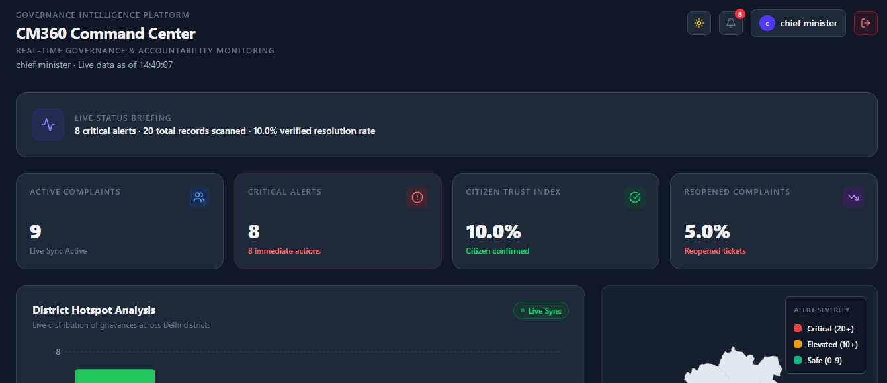
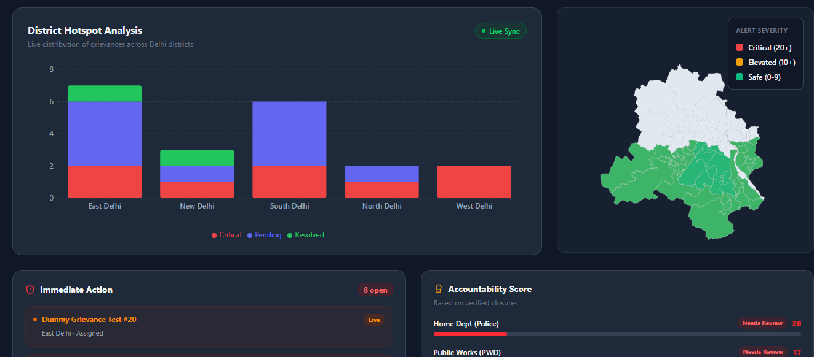

<div align="center">

# 🏛️ CM360 — Governance Intelligence Platform

**CM360 is a real-time, closed-loop grievance monitoring and accountability system designed for Chief Ministers, government officials and everyday citizens. It bridges the gap between public reporting and bureaucratic action through automated routing, live analytics, and strict evidence-based verification.**

[](https://cm360-orpin.vercel.app/)
[]()
[]()
[]()
[]()
[]()

### 🚨 [CLICK HERE TO VIEW THE LIVE PROJECT](https://cm360-orpin.vercel.app/) 🚨

</div>

---

## 📸 Product Preview

<div align="center">

</div>

##

<div align="center">

<p><em>The CM Command Center — live district hotspots, citizen trust index, and critical alert monitoring.</em> (see more preview in assets folder)</p>
</div>


>

---

## 🎯 The Problem

Traditional grievance systems suffer from **"black hole" reporting** — citizens file complaints and never hear back, while top officials have no real oversight into which departments are actually resolving issues versus quietly closing tickets without action.

This isn't a tooling gap. It's an **accountability gap**, and most systems are built in a way that lets it persist.

## 💡 The Solution

CM360 closes the loop structurally, not procedurally — the system makes false closures and silent stalling difficult, rather than just discouraging them as policy.

| Mechanism | What It Does |
|---|---|
| 🧭 **Automated Magic Routing** | Every grievance is auto-assigned to the exact officer responsible for that district + department — no manual sorting, no bounced tickets. |
| 📷 **Anti-Corruption Verification** | Officers cannot mark a ticket "Resolved" by clicking a button. They are structurally required to upload photographic evidence of the fix. |
| ✅ **Citizen Trust Loop** | A ticket is only permanently closed once the citizen verifies the resolution. Rejected fixes reopen automatically and impact the department's accountability score. |
| 📊 **Live Department Scoreboard** | Every department (PWD, DJB, BSES) is ranked on real, verified closures — not self-reported numbers. |

---

## ✨ Key Features

- **CM Command Center** — A high-level analytics dashboard with live sync, critical alert monitoring, and a real-time Citizen Trust Index.
- **District Hotspot Mapping** — Live visual distribution of grievances across Districts, built with Recharts.
- **Department Accountability Scoreboard** — Algorithmic performance scoring based on verified closures, not self-reported status.
- **The Citizen Trust Loop**: A dual-verification pipeline where the citizen who filed the grievance holds the final authority to permanently close the ticket or reopen it if the officer's resolution is unsatisfactory.
- **Secure Evidence Vault** — Cloudinary-backed, immutable photo storage for both citizen-filed and officer-resolved evidence.
- **Role-Based Access Control (RBAC)** — Strict JWT-driven middleware enforcing data isolation between Citizens, Officers, and Admins.
- **Fully Mobile Responsive** — All four portals (CM, Officer, Citizen, Admin) are built mobile-first with Tailwind, so the CM or any officer can review and act on grievances directly from a phone in the field.

---

## 🚀 Live Demo & Test Access

The platform is fully deployed and ready for review — no setup required.

**🔗 Live Link:** [https://cm360-orpin.vercel.app/](https://cm360-orpin.vercel.app/)


### 🔑 Demo Accounts

> ⚠️ Login page is same for every role - After successful authentication, the platform automatically identifies the user's role and redirects them to the appropriate dashboard.

| Role | Email | Password | Access Level |
|---|---|---|---|
| 🏛️ **Chief Minister** | `cm@delhi.gov.in` | `12345` | CM Command Center, live district hotspots, departmental accountability scores |
| 👮 **Department Officer** | `sanjay@gmail.com` | `12345` | Assigned district tickets; must upload photo evidence to resolve grievances |
| 👤 **Citizen** | `kanishk@gmail.com` | `12345` | File grievances, track live status, verify or reject officer resolutions |
| 👨🏻‍💻 **Admin** | `admin@gmail.com` | `12345` | Admin portal, add and manage department officers |

## 🧭 Reviewer Walkthrough — See the Full Loop in 5 Minutes
 
The fastest way to evaluate CM360 is to follow the grievance through its **entire lifecycle** — from citizen filing to officer resolution to citizen verification to its impact on CM-level analytics. Follow these steps in order:
  
**Step 1 — File a complaint as Citizen**
Log in with the **Citizen** credentials above. File a new grievance and select:
- **District:** `Central Delhi`
- **Department:** `Water & Sanitation`
> ⚠️ These exact values are required for the demo — the seeded database currently has an officer mapped only to Water & Sanitation in Central Delhi. Other combinations will not show an assigned officer.
 
**Step 2 — Check the CM Dashboard**
Log in with the **CM / Admin** credentials. You'll see the new ticket reflected in the live counters (moving from `0` to `1`) and appearing on the **District Hotspot Map** for Central Delhi.
 
**Step 3 — Resolve it as Officer**
Log in with the **Officer** credentials. You'll see the complaint as an **assigned card**. Open it and use the **Upload Proof** card to attach a resolution photo, then press **Submit**.
 
**Step 4 — Reject the resolution as Citizen (test the trust loop)**
Go back to the **Citizen** login. You'll now see a **verification request** with two options: **Yes** and **No, Reopen**. Select **No, Reopen** to simulate a disputed resolution.
 
**Step 5 — Confirm the reopen impacts CM analytics**
Return to the **CM Dashboard**. You'll see the **Reopen Rate** increase — proof that false or disputed closures are reflected immediately in accountability metrics, not hidden.
 
**Step 6 — Resolve it properly as Officer**
Go back to the **Officer** login and upload evidence again on the same ticket.
 
**Step 7 — Verify and close as Citizen**
Return to the **Citizen** login and this time click **Yes** to confirm the resolution.
 
**Step 8 — Watch the Citizen Trust Index respond**
Go back to the **CM Dashboard** one final time — you'll see the **Citizen Trust Index** update, reflecting the verified, citizen-confirmed resolution.
 
This full loop is the core of what CM360 is built to prove: **no ticket is truly closed until the citizen says so, and every dispute is visible at the CM level in real time.**

---

## 🛠️ Technical Architecture

Built on the **MERN** stack with a fully decoupled, independently scalable frontend and backend.

```
┌─────────────────┐      ┌──────────────────┐      ┌─────────────────┐
│   React.js       │ ───▶ │   Node.js /        │ ───▶ │   MongoDB Atlas   │
│   Tailwind CSS    │      │   Express.js       │      │   Mongoose ODM    │
│   Recharts         │      │   JWT Auth Layer   │      │   Schema Validation│
│   (Vercel)          │      │   (Render)           │      │                     │
└─────────────────┘      └──────────────────┘      └─────────────────┘
                                    │
                                    ▼
                          ┌──────────────────┐
                          │   Cloudinary API   │
                          │   Evidence Storage  │
                          └──────────────────┘
```

| Layer | Technology | Notes |
|---|---|---|
| **Frontend** | React.js, Tailwind CSS, Lucide Icons, Recharts | Hosted on Vercel |
| **Backend** | Node.js, Express.js, JWT Authentication | Hosted on Render |
| **Database** | MongoDB Atlas + Mongoose ODM | Strict enum schema validation |
| **Storage** | Cloudinary API | Multipart/form-data image handling for evidence uploads |

---

## 💻 Local Setup & Installation

### Prerequisites
- Node.js (v16+)
- MongoDB Atlas account
- Cloudinary account

### 1. Clone the repository
```bash
git clone https://github.com/kanishk-Panchal/CM360-Governance-Intelligence-Platform.git
```

### 2. Install dependencies
```bash
# Backend
cd backend
npm install

# Frontend
cd frontend
npm install
```

### 3. Configure environment variables

Create a `.env` file inside `/server`:

```env
PORT=5000
MONGO_URI=your_mongodb_atlas_connection_string
JWT_SECRET=your_jwt_secret_key
CLOUDINARY_CLOUD_NAME=your_cloudinary_cloud_name
CLOUDINARY_API_KEY=your_cloudinary_api_key
CLOUDINARY_API_SECRET=your_cloudinary_api_secret
```


### 4. Run the application
```bash
# Terminal 1 — start backend
cd backend
npm run dev

# Terminal 2 — start frontend
cd frontend
npm run dev
```

The app will be running at `http://localhost:5173` (frontend) and `http://localhost:5000` (backend API).

---

## 🗺️ Roadmap

- [ ] WhatsApp Business API integration for grievance filing
- [ ] MCD311 API sync with graceful fallback
- [ ] AI-based auto-categorization and duplicate detection
- [ ] Officer fraud-score analytics dashboard
- [ ] Multi-language support (Hindi, Punjabi, Urdu)

---

## 👥 Team zerolatency

### ~ kanishk Panchal
### ~ Manish Verma

---

## 📄 License

### The platform is fully deployed. Judges and reviewers can immediately explore the system using the live link and test credentials
---

<div align="center">

**Built to close the loop between citizens and government.**

[Live Demo](https://cm360-orpin.vercel.app/) · Made with ❤️ for Delhi

</div>

